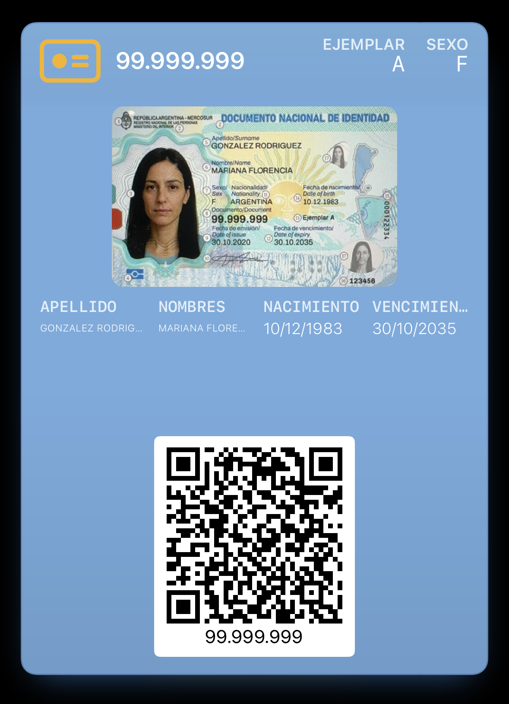

# DNI en Wallet

Una copia de referencia del DNI argentino como pase de Apple Wallet (`.pkpass`), para tenerlo a mano en el teléfono. PWA en JavaScript puro y un endpoint de firma sin dependencias.

> **No es un documento.** El pase no tiene validez legal y no reemplaza ni al DNI de plástico ni al DNI Digital de Mi Argentina. Lleva escrito «Copia de referencia — sin validez oficial» en el dorso. El DNI Digital oficial está atado criptográficamente al dispositivo: no se puede copiar, y no es lo que se busca acá.

## Cómo funciona

1. Se saca la foto del **frente** y, si hace falta, la del **dorso**, con la cámara de la página y un marco con la proporción real de la tarjeta.
2. El código se busca en las dos caras, porque según la generación del DNI está adelante o atrás: **PDF417** en los DNI tarjeta y **QR** en el electrónico que el RENAPER empezó a emitir en 2026. Se reconocen tres formatos por su forma: el PDF417 nuevo (2012 en adelante, 9 campos), el viejo (2009–2012, 16 o 17 campos, con vencimiento y nacionalidad) y el del DNI electrónico, que no trae sexo, abrevia los años y termina con un token firmado.
3. **Ese token firmado no entra en el pase.** Es lo que hace verificable al documento; copiarlo sería convertir una copia de referencia en un facsímil. Se guardan los datos, no la firma.
4. Se completan solos apellido, nombres, DNI, nacimiento, ejemplar, trámite y emisión — y el sexo, salvo en el DNI electrónico, cuyo código no lo trae. El CUIL se calcula con la fórmula pública (prefijo por sexo más dígito verificador módulo 11) y la nacionalidad se sugiere cuando el número está por debajo de la serie de extranjeros. Todo campo se puede corregir a mano.
5. El encuadre se ajusta en el marco: arrastrar mueve, pellizcar acerca, doble toque reinicia. Lo que se ve en el marco es lo que va al pase.
6. «Agregar a Apple Wallet» arma el pase y lo entrega al teléfono.

## Qué viaja al servidor

El pase se arma entero en el navegador: `pass.json`, las imágenes y el zip. Para firmarlo, al servidor viajan **todos los datos del formulario** —apellido, nombres, número de DNI, sexo, fechas, ejemplar, trámite, CUIL, nacionalidad y el texto crudo del código leído— y tres hashes SHA-1 de las imágenes, alrededor de medio kilobyte. **La foto no viaja.**

Los datos sí tienen que viajar siempre: la firma exige la clave privada del certificado de Apple, y esa clave no puede estar en el teléfono sin quedar expuesta para cualquiera.

Hay un camino de respaldo, `/api/pass`, para cuando el armado en el teléfono falla (por ejemplo, sin service worker). Ese camino **sí sube la imagen de la tarjeta**, así que nunca se usa solo: la página explica qué se va a mandar y espera a que la persona toque «Enviar al servidor». Si elige «No, gracias», no sale nada.

El servidor **no firma un manifest ajeno**: arma él mismo el `pass.json`, calcula los hashes de sus propios iconos y firma únicamente ese manifest. Firmar hashes a ciegas convertiría el endpoint en un oráculo de firma, donde cualquiera podría hacerse firmar un pase inventado con el certificado de Apple.

El `.pkpass` terminado lo entrega el **service worker**: la página le pasa los bytes y navega a `/pkpass/<serial>.pkpass`, que responde localmente con el `Content-Type` que Wallet espera.

`/api/sign` está limitado a 6 pedidos cada 10 segundos por IP y rechaza un `Origin` de otro sitio, para que
nadie lo use como servicio de firma ajeno.

No se guarda nada del documento en ninguno de los dos caminos: la request entra, se firma y se responde. Los logs de invocación de Workers están apagados (`wrangler.toml`); si algo falla con un error 5xx queda solo el mensaje del error, sin los datos. No hay base de datos, ni cuentas, ni cookies, ni analítica en la página, ni un solo pedido a otro dominio.

Lo único que queda es un **contador**: cada firma exitosa suma un evento en Workers Analytics Engine con una sola palabra, el camino (`sign` o `pass`). No lleva IP, ni datos, ni serial, ni nada que permita saber de quién es el pase; sirve para saber cuántos pases se generaron. Cuenta pases firmados, no pases agregados a Wallet: eso no se puede ver sin que el teléfono le hable al servidor, y no queremos que lo haga.

## El pase

Estilo `storeCard`, con los colores de la bandera: celeste de fondo, el logo en amarillo y el texto en blanco. La foto del documento ocupa el strip, con las esquinas redondeadas.



*(datos de ejemplo, DNI en el rango 95.000.000–99.999.999 sin asignar)*

Wallet dibuja adelante una sola fila de cuatro campos y descarta el resto en silencio, así que adelante van apellido, nombres, nacimiento y vencimiento, más sexo y ejemplar en el encabezado y el número de DNI en el logo. Todo lo demás vive en el dorso, que se abre con el botón «•••»: el aviso legal, el nombre completo, el número de trámite, el CUIL, la nacionalidad, las fechas y el código PDF417 crudo.

El dorso también tiene un acceso directo a la app **Mi Argentina**, para cuando hace falta el DNI Digital oficial y no solo esta copia de referencia.

## Estructura

```
public/                 la PWA entera, y lo que también usa el servidor:
  index.html app.js styles.css sw.js manifest.webmanifest icons/ _headers
  pass-json.js          arma pass.json — una sola fuente para el pase y la vista previa
  pkpass-build.js       zip, manifest y hashes — corre igual en el navegador y en Node
  pass-assets.js        iconos del pase en base64 (generado por `npm run assets`)
  icons/                mark.svg es el icono del DNI: la página lo pinta como máscara CSS y de ahí salen los PNG
  vendor/               ZXing, copiado por `npm run vendor` (no entra en git)
server/pkpass.mjs       firma PKCS#7 sobre WebCrypto, sin dependencias
server/index.mjs        servidor local: estáticos + /api/sign + /api/pass + /api/health
worker/index.mjs        el mismo endpoint en Cloudflare Workers
certs/                  wwdr.pem, signerCert.pem, signerKey.pem (no entran en git)
```

## Correrlo

```bash
npm install            # ZXing y wrangler; copia ZXing a public/vendor
cp .env.example .env   # y completarlo
npm start              # http://localhost:8787
```

Sin certificados el servidor arranca igual, la PWA funciona completa y la firma responde 503. `GET /api/health` dice si la firma está lista.

Para probar desde el teléfono hace falta **HTTPS**: un túnel temporal (`cloudflared tunnel --url http://localhost:8787`) o el sitio desplegado.

## Certificados de Apple

Hace falta una cuenta de Apple Developer.

1. Crear un **Pass Type ID** en developer.apple.com → Identifiers.
2. Generar la clave y el pedido de certificado sin pasar por Keychain:
   ```bash
   openssl req -new -newkey rsa:2048 -nodes \
     -keyout certs/signerKey.pem -out certs/pass.csr \
     -subj "/CN=DNI en Wallet Pass Type ID/O=OneGoodMan Studio/C=AR"
   ```
3. Subir `certs/pass.csr` al Pass Type ID, bajar el `.cer` y convertirlo:
   ```bash
   openssl x509 -inform der -in ~/Downloads/pass.cer -out certs/signerCert.pem
   ```
4. Bajar el certificado **WWDR G4** de apple.com/certificateauthority y convertirlo:
   ```bash
   openssl x509 -inform der -in AppleWWDRCAG4.cer -out certs/wwdr.pem
   ```

El servidor lee los certificados de `CERT_DIR` o de las variables `WWDR_PEM_B64`, `SIGNER_CERT_PEM_B64` y `SIGNER_KEY_PEM_B64`, que tienen prioridad y sirven para un hosting sin disco.

## Despliegue

Cloudflare Workers sirve la PWA como Static Assets y el Worker atiende `/api/*`. Cada push a `main` dispara una build que despliega sola; también funciona `npm run deploy` a mano. Los certificados se cargan como secrets con `npm run secrets`.

Las cabeceras de seguridad están en `public/_headers`: HSTS, CSP, `nosniff`, `no-referrer`, COOP, CORP y una política de permisos que deja la cámara solo para esta página.

## Lo que falta probar en un iPhone

- La hoja de Wallet desde el modo **pantalla de inicio**. Desde Safari funciona; en standalone hay que confirmarlo.
- La lectura del PDF417 con **fotos reales**, con brillos y en ángulo.
- La orientación EXIF en iOS viejos.

## Privacidad y límites

Los datos salen únicamente del documento que tiene el usuario en la mano: el código de barras y sus propias fotos. **Nunca se consulta un número de DNI contra ningún padrón**, ni se buscan datos de terceros. La tarjeta tiene un diseño propio a propósito: es una copia de referencia, no un facsímil del documento oficial.

## Licencia

MIT — ver [`LICENSE`](LICENSE). La licencia cubre el código; no autoriza a presentar un clon como si fuera este sitio, y los certificados de Apple no forman parte del repositorio.
